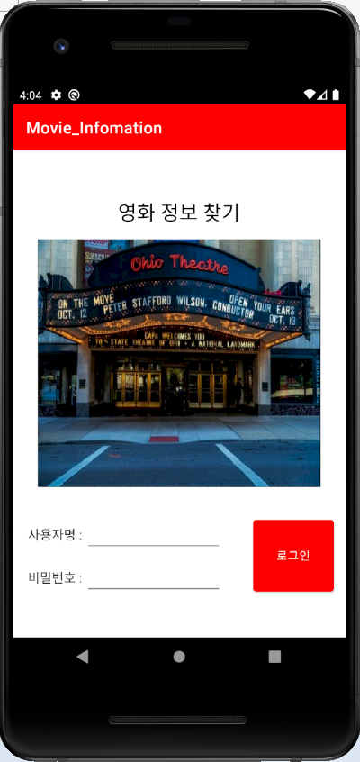
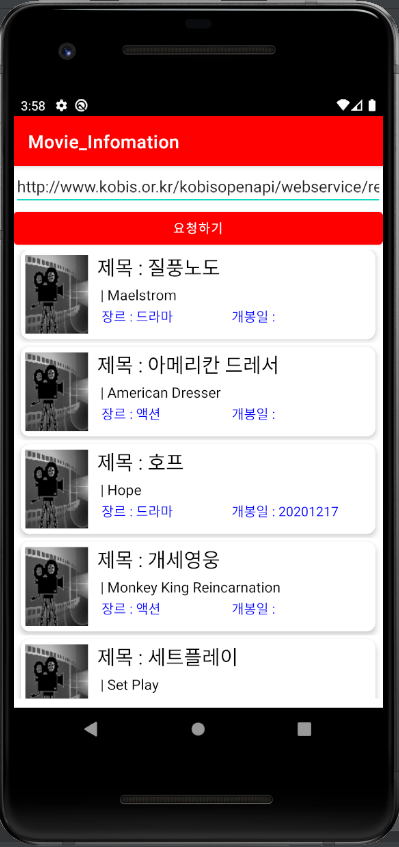

# 영화 정보 제공 앱

</img>
</img>

## 프로젝트 구현방법

영화의 정보를 찾는 앱을 만들기 위해 "영화목록 API"를 사용하여 앱을 제작했다.

URL을 요청한 후 나오는 정보들을 1. 영화제목 (한국어, 영어) 2. 영화의 장르 3. 개봉일 로 정하였다.

이 정보들을 순서대로 나오게 하기 위해

cardview안에 LinearLayout을 vertical로 조정한 뒤 TextView 2개를 배치하여 제목을 나타나게 했다. (한국어, 영어 제목) 

그 안에 LinearLayout을 하나 더 만들어 horizontal로 조정한 뒤 TextView 2개를 옆으로 배치하여 장르와 개봉일이 함께 나타나게 했다.

안드로이드 앱 실행시 앱의 특성을 더 살리기 위해 타이틀바를 #FF0000 색으로 바꾸었다.
